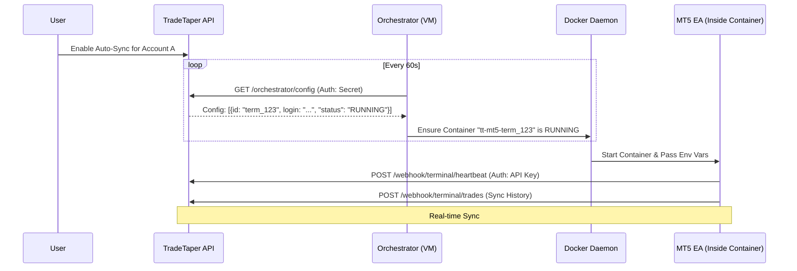

# TradeTaper Terminal Farm & MT5 Sync Guide

**Branch:** `terminal-farm`

This guide details the "Terminal Farm" architecture implemented in TradeTaper. This system allows for the scalable, headless synchronization of multiple MetaTrader 5 (MT5) accounts using Docker containers and a custom Python orchestrator.

## 1. System Overview

The Terminal Farm is a distributed system designed to:
- Run multiple MT5 instances in the cloud (headless).
- Sync trade history and real-time positions to the TradeTaper backend.
- Automatically manage the lifecycle of these instances based on user settings.

### Core Components

1.  **MT5 Expert Advisor (EA)**: `TradeTaperSync.mq5`
    - Runs inside the MT5 terminal.
    - Captures trade events and sends them to the backend via HTTP Webhooks.
2.  **Containerized Terminal**: `Dockerfile`
    - A custom Docker image capable of running MT5 on Linux using WINE.
3.  **Backend Controller**: `TerminalFarmService` (Node.js/NestJS)
    - Receives data from EAs.
    - Exposes configuration for the Orchestrator.
4.  **Orchestrator**: `orchestrator.py`
    - A Python script running on the host VM.
    - Polls the backend and spins up/down Docker containers automatically.

---

## 2. Architecture & Data Flow



---

## 3. Code Breakdown

### A. The Expert Advisor (`terminal-farm/ea/TradeTaperSync.mq5`)
This MQL5 script is the "boots on the ground". It uses `WebRequest` to send JSON data to your API.
- **Inputs**: `APIEndpoint`, `APIKey`, `TerminalId`.
- **Functions**:
  - `OnTick()`: Checks for position changes.
  - `OnTradeTransaction()`: Captures closed trades immediately.
  - `SendHeartbeat()`: Keeps the connection alive in the backend.

### B. The Orchestrator (`terminal-farm/orchestrator.py`)
This script enables multi-account scaling on a single machine without manual intervention.
- **Logic**: It compares the *desired state* (from API) with the *actual state* (Docker).
- **Security**: It fetches **decrypted** credentials securely from the backend to inject into containers explicitly.
- **Self-Healing**: It restarts crashed containers automatically.

### C. Backend Services (`tradetaper-backend/src/terminal-farm/`)
- **`TerminalFarmService`**: authenticates webhooks and maps `TerminalId` to `AccountId`.
- **`TerminalOrchestratorController`**: Serves the configuration to the python script.
- **`MT5AccountsService`**: Handles the encryption/decryption of sensible MT5 passwords.

---

## 4. Usage Guide

### Prerequisites
1.  **Cloud VM**: A machine (e.g., Google Cloud Compute, AWS EC2) running Ubuntu.
2.  **Docker**: Installed and running on the VM.
3.  **Domain/SSL**: Your backend must be accessible via HTTPS (required by MT5 WebRequest).

### Step 1: Deploy Backend
Ensure your backend is running with the new Orchestrator endpoints.
```bash
# Env var required on Backend
ORCHESTRATOR_SECRET=super_secure_secret_string
```

### Step 2: Setup Orchestrator (On VM)
Copy `terminal-farm/orchestrator.py` to your VM.
```bash
# Install dependencies
pip install docker requests

# Run Orchestrator
export API_ENDPOINT="https://api.your-domain.com"
export ORCHESTRATOR_SECRET="super_secure_secret_string"
export IMAGE_NAME="tradetaper/mt5-terminal:latest"

python3 orchestrator.py
```
*Tip: Run this with `nohup` or a systemd service to keep it alive.*

### Step 3: Add Accounts
1.  Go to **Settings > Metatrader Integration**.
2.  Add an MT5 account (Login, Password, Server).
3.  Click **Enable Auto-Sync**.
4.  **Wait**: Within 60 seconds, the Orchestrator will see the new account and spin up a docker container.
5.  **Verify**: The status card will show "Synced just now" once the EA connects.

---

## 5. Possibilities & Extensions

This infrastructure is a powerful foundation for advanced trading features:

1.  **Copy Trading / Signal Provider**
    - You can easily extend the Backend to broadcast trades received from one "Master" `TerminalId` to other connected accounts via API APIs or even back to other terminals.

2.  **Automated Journaling**
    - Since the EA syncs *history*, you effectively have an automated trade journal that updates seconds after a trade closes.

3.  **Prop Firm Management**
    - Managing 20+ prop firm accounts becomes trivial. Just add them to the dashboard, and the farm handles the containers.

4.  **Market Analysis**
    - The EA receives all tick data. You could extend it to send market data for AI analysis in the backend.

---

## 6. How to Use in Your Own App

To port this to another application:
1.  **Copy `terminal-farm/`**: This contains the Docker and EA logic which is generic.
2.  **Implement Webhooks**: Your backend needs to accept POST requests at `/webhook/terminal/*`.
3.  **Implement Config Endpoint**: Your backend needs to serve a JSON list of accounts for the Orchestrator.
4.  **Database**: You need a schema to map `TerminalID` -> `UserID`.

**Relevant Files for Porting:**
- [`terminal-farm/Dockerfile`](terminal-farm/Dockerfile)
- [`terminal-farm/orchestrator.py`](terminal-farm/orchestrator.py)
- [`terminal-farm/ea/TradeTaperSync.mq5`](terminal-farm/ea/TradeTaperSync.mq5)
